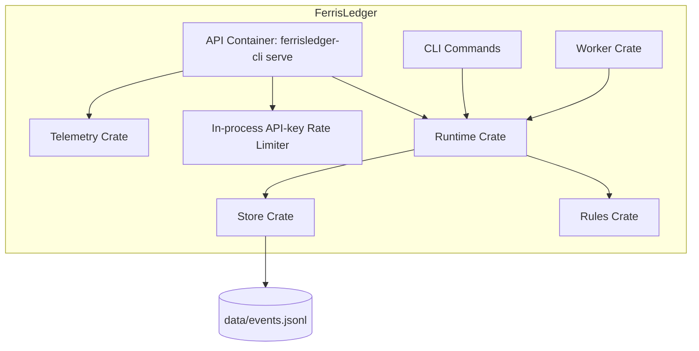

# C4 Container

```mermaid
flowchart TD
  subgraph FerrisLedger
    API[API Container: ferrisledger-cli serve]
    Limiter[In-process API-key Rate Limiter]
    CLI[CLI Commands]
    Runtime[Runtime Crate]
    Rules[Rules Crate]
    Store[Store Crate]
    Worker[Worker Crate]
    Telemetry[Telemetry Crate]
  end
  API --> Runtime
  API --> Limiter
  CLI --> Runtime
  Worker --> Runtime
  Runtime --> Rules
  Runtime --> Store
  API --> Telemetry
  Store --> Log[(data/events.jsonl)]
```
