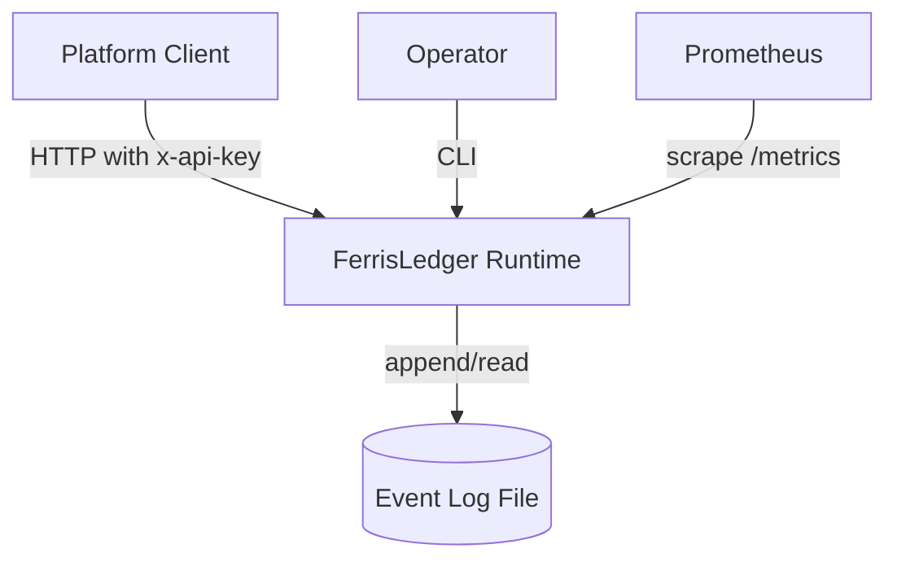

# C4 Context

```mermaid
flowchart TD
  Platform[Platform Client] -->|HTTP with x-api-key| FerrisLedger[FerrisLedger Runtime]
  Operator[Operator] -->|CLI| FerrisLedger
  FerrisLedger -->|append/read| EventLog[(Event Log File)]
  Prometheus[Prometheus] -->|scrape /metrics| FerrisLedger
```

FerrisLedger is an internal component. It does not directly call external Pix
providers in this MVP.
