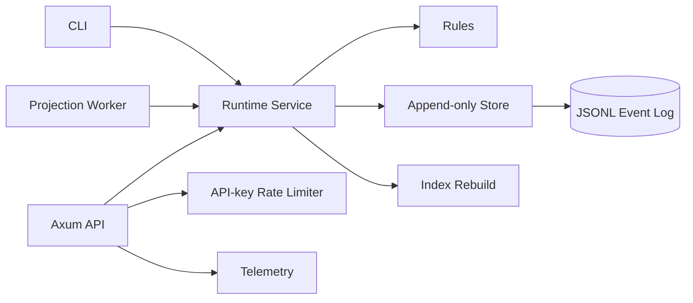

# Architecture Overview

FerrisLedger is a modular Rust monolith. The API and CLI are adapters, the
runtime crate owns use-case orchestration, the rules crate owns financial
decisions, and the store crate owns durability.

The main architectural constraint is that domain/rules must not depend on HTTP,
CLI, rate-limit state, or file-system APIs.
