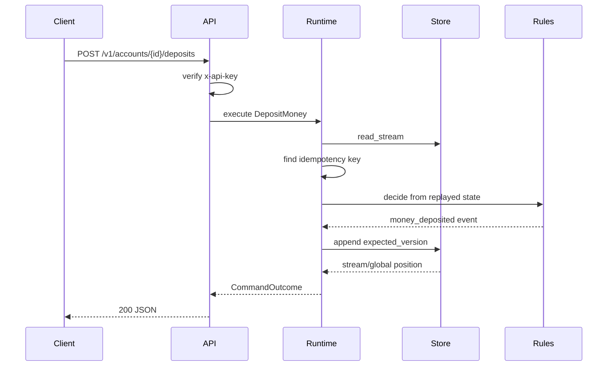
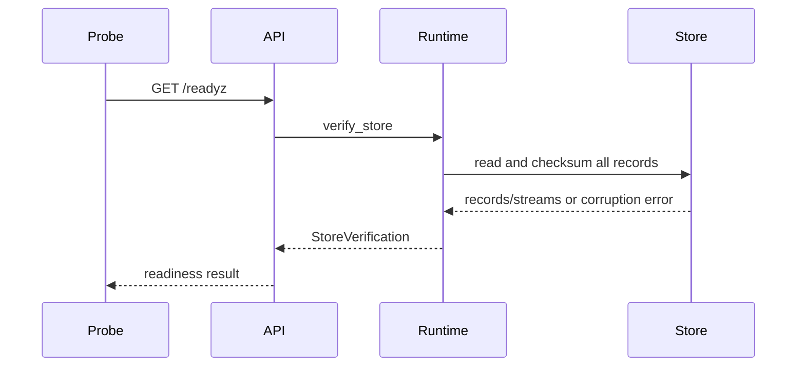

# Sequence Diagrams

## Deposit Command

```mermaid
sequenceDiagram
  participant Client
  participant API
  participant Runtime
  participant Store
  participant Rules
  Client->>API: POST /v1/accounts/{id}/deposits
  API->>API: verify x-api-key
  API->>Runtime: execute DepositMoney
  Runtime->>Store: read_stream
  Runtime->>Runtime: find idempotency key
  Runtime->>Rules: decide from replayed state
  Rules-->>Runtime: money_deposited event
  Runtime->>Store: append expected_version
  Store-->>Runtime: stream/global position
  Runtime-->>API: CommandOutcome
  API-->>Client: 200 JSON
```

## Readiness Verification

```mermaid
sequenceDiagram
  participant Probe
  participant API
  participant Runtime
  participant Store
  Probe->>API: GET /readyz
  API->>Runtime: verify_store
  Runtime->>Store: read and checksum all records
  Store-->>Runtime: records/streams or corruption error
  Runtime-->>API: StoreVerification
  API-->>Probe: readiness result
```
