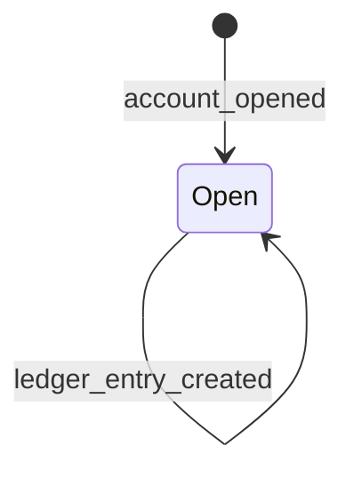
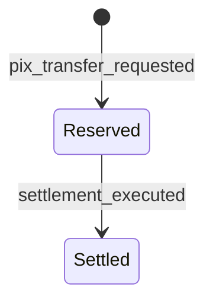

# State Machines

## Account

Frozen and closed states are modeled in code as future states, but no command
currently emits those transitions. That keeps the current workflow focused
while leaving lifecycle expansion explicit.

## Pix Reservation

